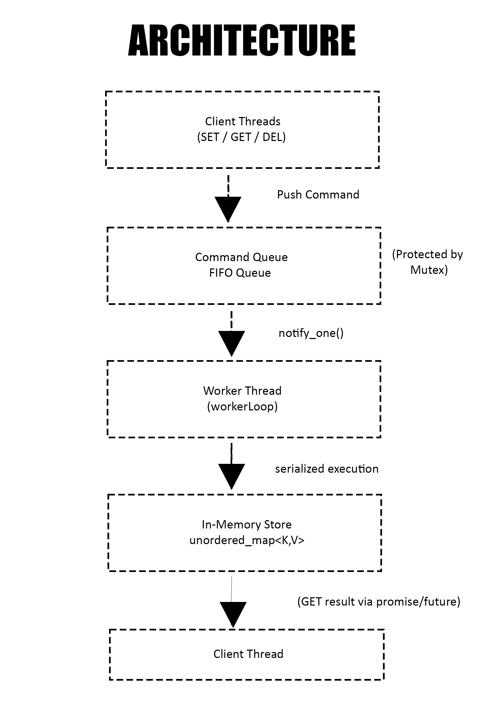

# Redis-Lite

> A lightweight, Redis-inspired in-memory key-value store built from scratch in C++ to deeply understand backend fundamentals, concurrency, and system design.



---

## 📊 Project Status

🚧 **Work in Progress** - Active Learning Project

- **Total Code Written**: ~169 lines of C++ (excluding comments)
  - `RedisLite.h`: 44 lines
  - `RedisLite.cpp`: 89 lines  
  - `main.cpp`: 36 lines
- **Current Version**: v0.1 (Core functionality complete)
- **Started**: December 2025
- **Purpose**: Learning backend internals and concurrency patterns

---

## 🎯 Why I Built This

While working on backend web applications, I realized that although I could build APIs and connect databases, I didn't clearly understand **backend fundamentals** like:

- ❓ Why is Redis so fast?
- ❓ How does in-memory storage actually work?
- ❓ What are race conditions and how to prevent them?
- ❓ Why does Redis use a single-threaded execution model?
- ❓ How does concurrency differ from parallelism?

**I wanted to transition from:**
> "I can build backend apps"  
**to**  
> "I understand how backend systems actually work"

So I decided to build a minimal Redis-like system from scratch to learn by doing.

---

## 🧠 What I Learned

### Key Concepts Implemented:
✅ **Thread-safe programming** with mutexes and condition variables  
✅ **Producer-Consumer pattern** using command queues  
✅ **Single-threaded execution model** (like real Redis)  
✅ **Promise/Future pattern** for async result handling  
✅ **RAII principles** for resource management  
✅ **Move semantics** for efficient object transfer  
✅ **In-memory data structures** (hash maps)  
✅ **Serialized execution** to prevent race conditions  

### The Key Insight:
> **"Mutex alone doesn't guarantee correctness, design does."**

By serializing all operations through a single worker thread, race conditions are eliminated entirely—without complex locking logic.

---

## 🏗️ Architecture

### High-Level Design

```
┌─────────────────────────────────────────────────────────────┐
│                      Client Threads                          │
│              (Multiple threads calling SET/GET/DEL)          │
└────────────────────────┬────────────────────────────────────┘
                         │
                         │ Push commands to queue
                         ▼
┌─────────────────────────────────────────────────────────────┐
│                    Command Queue (FIFO)                      │
│              Protected by mutex + condition_variable         │
└────────────────────────┬────────────────────────────────────┘
                         │
                         │ notify_one() wakes worker
                         ▼
┌─────────────────────────────────────────────────────────────┐
│                    Worker Thread                             │
│        Processes commands ONE AT A TIME (serialized)         │
└────────────────────────┬────────────────────────────────────┘
                         │
                         │ Executes on store
                         ▼
┌─────────────────────────────────────────────────────────────┐
│              In-Memory Store (Hash Map)                      │
│        unordered_map<string, string>                         │
│        NO mutex needed - only worker accesses it!            │
└─────────────────────────────────────────────────────────────┘
                         │
                         │ Results returned via promise/future
                         ▼
┌─────────────────────────────────────────────────────────────┐
│                    Client Threads                            │
│             (Receive results asynchronously)                 │
└─────────────────────────────────────────────────────────────┘
```

### How It Works

1. **Multiple client threads** can call `set()`, `get()`, or `del()` concurrently
2. Each operation creates a `Command` object and pushes it to a **thread-safe queue**
3. A **condition variable** notifies the worker thread when commands are available
4. The **worker thread** processes commands **one by one** in FIFO order
5. For `GET` operations, the worker uses `std::promise` to send results back to the client
6. The **data store** is only accessed by the worker thread—**no race conditions possible**

---

## ⚙️ Features

### ✅ Currently Implemented

| Feature | Status | Description |
|---------|--------|-------------|
| **SET** | ✅ Complete | Store a key-value pair |
| **GET** | ✅ Complete | Retrieve value by key |
| **DEL** | ✅ Complete | Delete a key |
| **Thread Safety** | ✅ Complete | Multiple threads can safely call operations |
| **Single-threaded Execution** | ✅ Complete | Serialized command processing |
| **Async Result Handling** | ✅ Complete | Promise/Future pattern for GET |

### 🚧 Planned Features (Learning Roadmap)

| Feature | Status | Priority |
|---------|--------|----------|
| **TTL (Time To Live)** | 📝 Planned | High |
| **Persistence (AOF)** | 📝 Planned | Medium |
| **Command Pipeline** | 📝 Planned | Low |
| **TCP Network Server** | 📝 Planned | Future |
| **RESP Protocol** | 📝 Planned | Future |
| **Complex Data Types** | 📝 Planned | Future |
| **Pub/Sub** | 📝 Planned | Future |

---

## 🔧 Technical Implementation

### Core Components

#### 1. Command Structure
```cpp
enum class CommandType { SET, GET, DEL };

struct Command {
    CommandType type;
    std::string key;
    std::string value;
    std::promise<std::string> result; // For async GET
};
```

#### 2. RedisLite Class
```cpp
class RedisLite {
private:
    std::unordered_map<std::string, std::string> store;  // In-memory data
    std::queue<Command> commandQueue;                     // FIFO command queue
    std::mutex queueMutex;                                // Protects the queue
    std::condition_variable cv;                           // Wakes worker thread
    std::thread worker;                                   // Background worker
    bool stop = false;                                    // Shutdown flag

    void workerLoop();  // Worker thread function

public:
    RedisLite();   // Starts worker thread
    ~RedisLite();  // Graceful shutdown
    
    void set(const std::string &key, const std::string &value);
    std::string get(const std::string &key);
    void del(const std::string &key);
};
```

#### 3. Worker Loop (Heart of the System)
```cpp
void RedisLite::workerLoop() {
    while (true) {
        Command cmd;
        {
            std::unique_lock<std::mutex> lock(queueMutex);
            cv.wait(lock, [&]() {
                return !commandQueue.empty() || stop;
            });

            if (stop && commandQueue.empty()) break;

            cmd = std::move(commandQueue.front());
            commandQueue.pop();
        }

        // Execute command (no mutex needed on store!)
        if (cmd.type == CommandType::SET) {
            store[cmd.key] = cmd.value;
        }
        else if (cmd.type == CommandType::GET) {
            auto it = store.find(cmd.key);
            cmd.result.set_value(it != store.end() ? it->second : "");
        }
        else if (cmd.type == CommandType::DEL) {
            store.erase(cmd.key);
        }
    }
}
```

### 🔑 Why This Design Works

| Design Choice | Reason | Benefit |
|--------------|--------|---------|
| **Single worker thread** | Redis is primarily CPU-bound for in-memory ops | No lock contention on data store |
| **Command queue** | Decouples clients from execution | Clients don't block each other |
| **Condition variable** | Efficient sleeping/waking | No busy-waiting (CPU efficient) |
| **Promise/Future** | Type-safe async communication | Clean result passing without manual sync |
| **FIFO queue** | Preserves operation order | Predictable, linearizable behavior |

---

## 🚀 Getting Started

### Prerequisites
- C++11 or later
- g++ or clang compiler

### Build & Run

```bash
# Clone or download the repository
cd Redis-Lite

# Compile (C++11 required for threading support)
g++ -std=c++11 main.cpp RedisLite.cpp -pthread -o redis-lite

# Run the demo
./redis-lite
```

### Example Usage

```cpp
#include "RedisLite.h"
#include <thread>
#include <iostream>

int main() {
    RedisLite redis;

    // Multiple threads writing concurrently
    std::thread t1([&](){ redis.set("user1", "amit"); });
    std::thread t2([&](){ redis.set("user2", "sanjay"); });
    
    t1.join();
    t2.join();

    // Reading values
    std::thread t3([&](){
        std::cout << "user1: " << redis.get("user1") << std::endl;
    });
    
    t3.join();

    // Delete a key
    redis.del("user1");
    
    return 0;
}
```

**Output:**
```
user1: amit
user2: sanjay
```

---

## 💡 Key Learnings & Insights

### 1️⃣ **Why Redis is Single-Threaded**
- In-memory operations are **extremely fast** (~nanoseconds)
- The bottleneck is usually **network I/O**, not CPU
- Single-threaded execution eliminates:
  - Race conditions
  - Deadlocks
  - Complex locking logic
  - Cache coherence issues

### 2️⃣ **Concurrency vs Parallelism**
- **Client threads**: Run in parallel (different cores)
- **Worker thread**: Executes commands concurrently (one at a time)
- **Result**: Thread-safe without sacrificing simplicity

### 3️⃣ **Promise/Future Pattern**
- Client: "I need a value, but I'll wait for it"
- Worker: "I'll compute it and send it back when ready"
- Clean separation without manual mutex on results

### 4️⃣ **Condition Variables > Busy-Waiting**
```cpp
// ❌ BAD: Busy waiting (wastes CPU)
while (commandQueue.empty()) { /* spin */ }

// ✅ GOOD: Condition variable (sleeps efficiently)
cv.wait(lock, [&](){ return !commandQueue.empty(); });
```

---

## 📈 Performance Characteristics

| Metric | Expected Performance |
|--------|---------------------|
| **Throughput** | ~100K-500K ops/sec (single-threaded) |
| **Latency** | Sub-microsecond (no I/O) |
| **Memory** | O(n) where n = number of keys |
| **Contention** | Minimal (only queue mutex) |

*Note: These are theoretical estimates for in-memory operations without networking*

---

## 🔍 What This Project Does NOT Include

This is an **educational project** focused on core concepts. It intentionally omits:

❌ Network layer (no TCP server)  
❌ Persistence (no disk writes)  
❌ Complex data types (only strings)  
❌ TTL/Expiration  
❌ Replication/Clustering  
❌ RESP protocol  
❌ Security/Authentication  

**Why?** To keep the focus on **concurrency patterns and system design fundamentals**.

---

## 🛣️ Learning Roadmap

### Phase 1: ✅ Core Implementation (Complete)
- [x] Thread-safe command queue
- [x] Single worker thread
- [x] SET/GET/DEL operations
- [x] Promise/Future pattern

### Phase 2: 🚧 Advanced Features (In Progress)
- [ ] Add TTL support with time-based expiration
- [ ] Implement lazy deletion
- [ ] Add INCR/DECR atomic operations
- [ ] Memory usage tracking

### Phase 3: 📝 Persistence (Planned)
- [ ] Append-Only File (AOF) logging
- [ ] Snapshot (RDB) support
- [ ] Recovery on restart

### Phase 4: 📝 Networking (Future)
- [ ] TCP socket server
- [ ] RESP protocol parser
- [ ] Multi-client support with epoll/select

---

## 🤔 Design Questions I Can Answer

After building this, I can now confidently explain:

1. **Why is Redis faster than a database?**  
   → It's in-memory (no disk I/O) and uses efficient data structures

2. **How do you prevent race conditions?**  
   → Serialize access to shared state (design, not just mutexes)

3. **What is the producer-consumer pattern?**  
   → Multiple producers (clients) + single consumer (worker)

4. **Why use condition variables?**  
   → Efficient thread synchronization without busy-waiting

5. **When should you use single-threaded execution?**  
   → When operations are CPU-bound and very fast

6. **How does promise/future work?**  
   → Shared state for async communication between threads

---

## 📚 Resources That Helped

- [Redis Design and Implementation](https://redisbook.readthedocs.io/) - Understanding Redis internals
- [C++ Concurrency in Action](https://www.manning.com/books/c-plus-plus-concurrency-in-action) - Threading patterns
- [System Design Primer](https://github.com/donnemartin/system-design-primer) - Caching concepts

---

## 🎓 Concepts Demonstrated

This project showcases understanding of:

- **Concurrency**: Mutexes, condition variables, thread safety
- **System Design**: Producer-consumer, command pattern, serialization
- **C++ Modern Features**: Move semantics, RAII, smart pointers concepts
- **Memory Management**: In-memory data structures, hash maps
- **Async Programming**: Promise/future pattern

---

## 🙋‍♂️ About This Project

This is a **learning project** I built to understand backend systems at a deeper level. 

The code is **intentionally simple** (~169 lines) because the goal is **clarity and understanding**, not feature completeness.

Every line of code was written with the question: *"Why does Redis do it this way?"*

---

## 📝 License

This is a personal learning project. Feel free to study, modify, and learn from it!

---

## 🔗 Connect

If you have questions or want to discuss backend systems, feel free to reach out!

---

<p align="center">
  <i>Built with curiosity, debugged with patience, understood through practice.</i>
</p>
